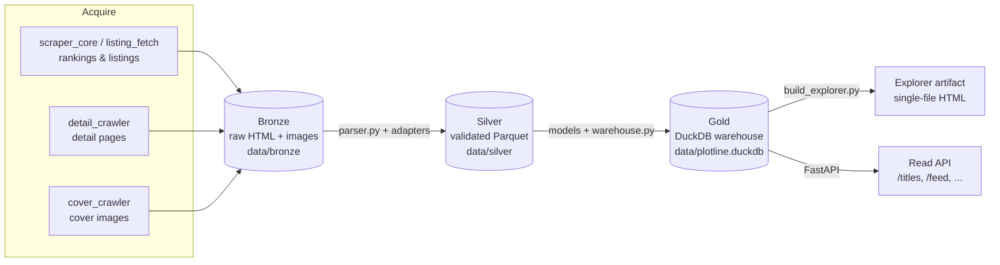
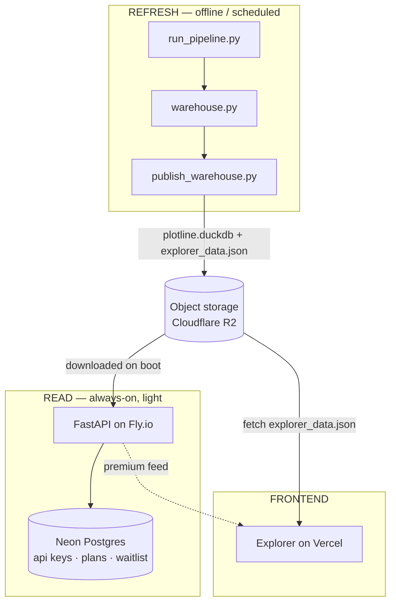

# Architecture

Plotline is a **medallion data pipeline** feeding a DuckDB warehouse, with two presentation
layers on top: a self-contained explorer artifact and a FastAPI read service.

## The medallion pipeline



- **Bronze** — raw platform HTML snapshots (and cover images), saved verbatim and partitioned
  by `source` and `date`. Nothing is interpreted here.
- **Silver** — every Bronze page is routed to its platform **adapter** and emitted as a
  `ComicRecord` conforming to one canonical schema ({doc}`data-model`). Written as partitioned
  Parquet under `data/silver/comics/`.
- **Gold** — the model layer (PlotScore, earnings, entity resolution, KPIs, art style, episode
  and unit stats) plus the **warehouse builder**, which assembles a single DuckDB file of
  facts, dimensions, entities, and KPI tables.

The whole chain is driven by one orchestrator, `run_pipeline.py` (see {doc}`pipeline`).

## Deployment architecture (split refresh / read)

The daily crawl is heavy (Playwright, thousands of pages) and cannot run on a small always-on
instance, so the production design splits **refresh** (offline/batch) from **read** (a light
API), connected by a published warehouse artifact:



See {doc}`deployment` for the concrete free-tier service map and go-live gates.

## Repository layout

```text
leesearch/
├── config.yaml                 # scraping targets, selectors, storage paths, processing params
├── run_pipeline.py             # orchestrator (16 stages)
├── requirements.txt
├── src/
│   ├── scrapers/               # acquisition
│   │   ├── scraper_core.py         # Playwright ranking scraper
│   │   ├── listing_fetch.py        # requests-based listing fetch (server-rendered sites)
│   │   ├── detail_crawler.py       # hardened detail-page enrichment
│   │   ├── cover_crawler.py        # cover-image download + base64 map
│   │   ├── backfill_archive.py     # Wayback Machine backfill
│   │   └── adapters/               # per-platform Bronze→record parsers
│   ├── pipelines/
│   │   ├── schema_contract.py      # canonical Silver record + schema
│   │   ├── parser.py               # Bronze→Silver driver
│   │   └── pipeline_updates.py     # day-over-day deltas / velocity
│   ├── models/                 # the Gold model layer (scores, KPIs, analytics)
│   ├── db/                     # warehouse builder, schema, publish
│   ├── reports/                # daily/weekly/visual reports + build_explorer + template
│   └── api/                    # FastAPI read layer + auth/billing/config
├── dags/comic_scraper_dag.py   # Airflow DAG (Linux fallback)
├── .github/workflows/          # refresh.yml (data) + docs.yml (this documentation)
├── Dockerfile · docker-compose.yml · fly.toml · vercel.json
└── DEPLOYMENT.md
```

## Technology stack

- **Scraping** — Playwright (async), BeautifulSoup, `requests`, fake-useragent.
- **Data** — Polars (primary), PyArrow, DuckDB, Pydantic (schema validation).
- **Analytics / ML** — scikit-learn, XGBoost, BERTopic; NumPy/SciPy via the metrics toolkit.
- **Vision** — Pillow + OpenCV for cover palette / painting-style clustering.
- **Serving** — FastAPI + Uvicorn; a single-file HTML explorer (vanilla JS, no framework).
- **Orchestration** — `run_pipeline.py`; Airflow DAG and GitHub Actions as alternatives.
