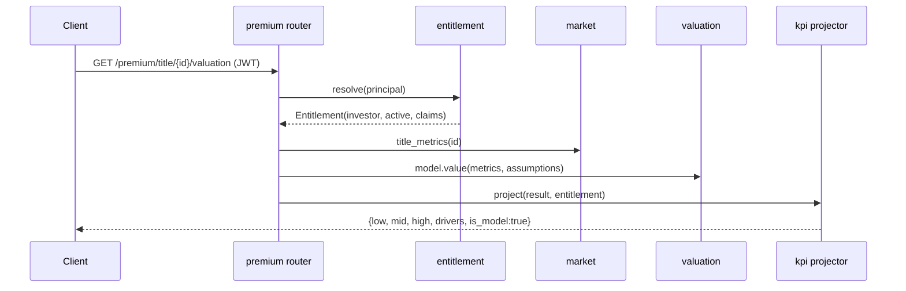
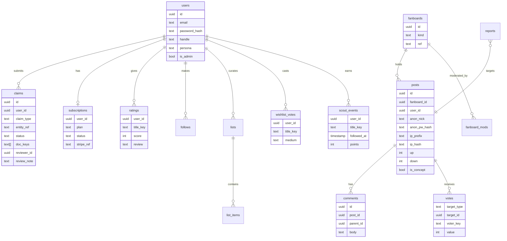
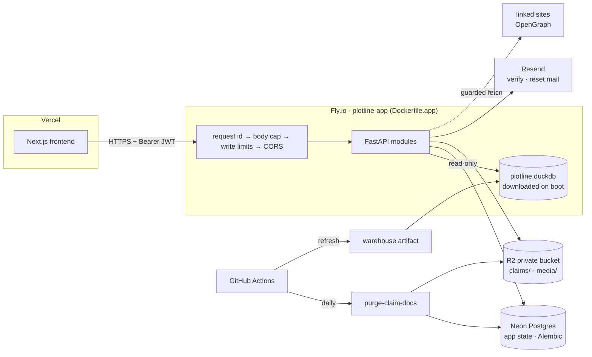

# Modular architecture blueprint (Phase 2 target)

Status: **design for review**. Companion: [product-spec.md](product-spec.md).

Goal: every model, business rule, storage backend and policy can be replaced without editing the code that calls it.

## 1. Principles
1. **Modules own their data.**
   - Each module has a `service.py` (public interface), a `repo.py` (the only code that touches its tables) and a `router.py` (thin HTTP layer).
   - Other modules call the service, or react to domain events. They never read another module's tables.
2. **Interfaces with registered implementations.** Replaceable behaviour is a `typing.Protocol` with named implementations in a registry, selected from config. Examples:
   - authentication provider
   - document storage
   - valuation model
   - post-promotion rule
   - fan-rating aggregator
   - scout scoring
3. **Policy as config.** Entitlements, KPI visibility, thresholds, weights and prices live in YAML or environment variables, not in `if` statements.
4. **The analytics pipeline is untouched.**
   - The Bronze→Silver→Gold pipeline and `src/models/*` stay as they are.
   - The `market` module wraps the DuckDB warehouse as read-only (today `src/api/main.py:37` opens it with `read_only=True`).
5. **Routes carry no business logic.** Routers validate input, call a service and project the output through the KPI registry.

## 2. Module map

```mermaid
flowchart TB
  subgraph api[api — thin routers]
    R1[accounts] --- R2[claims] --- R3[community] --- R4[fan] --- R5[market] --- R6[premium] --- R7[admin]
  end
  subgraph domain[domain modules]
    ID[identity<br/>AuthProvider]
    VE[verification<br/>ClaimService · DocStorage]
    EN[entitlement<br/>Policy from entitlements.yaml]
    KPI[kpi<br/>registry + projector]
    CO[community<br/>PromotionRule · AnonIdentity · Moderation]
    FA[fan<br/>RatingAggregator · ScoutRule]
    VA[valuation<br/>ValuationModel]
    MK[market<br/>read-only warehouse adapter]
  end
  subgraph core[core]
    CFG[config] --- DB[(app DB via SQLAlchemy Core<br/>SQLite dev / Postgres prod)] --- EV[event bus] --- REG[registry util]
  end
  WH[(DuckDB warehouse<br/>existing pipeline output)]
  api --> domain
  domain --> core
  MK --> WH
  VA --> MK
  FA -. events .-> CO
  VE -. claim.approved .-> EN
```

### Proposed layout
```
src/
  core/          config.py  db.py  events.py  registry.py
  identity/      provider.py (AuthProvider)  builtin_jwt.py  service.py  repo.py  router.py
  verification/ storage.py (DocStorage)  local_fs.py  service.py  repo.py  router.py
  entitlement/   policy.py  entitlements.yaml  service.py
  kpi/           registry.py  kpis.yaml  projector.py
  valuation/     base.py (ValuationModel)  revenue_multiple.py  service.py
  community/     rules.py (PromotionRule)  anon.py  moderation.py  service.py  repo.py  router.py
  fan/           ratings.py (RatingAggregator)  scout.py (ScoutRule)  service.py  repo.py  router.py
  market/        warehouse.py  indices.py (genre/composite indices, breadth, new listings)  service.py  router.py
  api/           main.py (app factory: mounts module routers)  billing.py  ratelimit.py
```
The existing `src/api/{auth,billing,config,ratelimit,warehouse_loader}.py` are either absorbed into `core` and `identity` or kept as they are. `src/api/auth.py` (API keys for `/feed`) stays.

## 3. Key interfaces (signatures only)

```python
class AuthProvider(Protocol):          # identity/provider.py
    def register(self, email: str, password: str, handle: str) -> User: ...
    def authenticate(self, email: str, password: str) -> Token: ...
    def verify(self, token: str) -> Principal: ...          # Clerk etc. can implement this later

class DocStorage(Protocol):            # verification/storage.py
    def put(self, data: bytes, mime: str) -> str: ...       # returns opaque key
    def get(self, key: str) -> bytes: ...                    # admin-only callers
    def delete(self, key: str) -> None: ...

class ValuationModel(Protocol):        # valuation/base.py
    name: str
    def value(self, title: TitleMetrics, assumptions: dict) -> ValuationBand: ...
    # ValuationBand = {low, mid, high, drivers: list[Driver], assumptions, is_model: True}

class PromotionRule(Protocol):         # community/rules.py
    def is_concept(self, up: int, down: int, age_h: float) -> bool: ...

class RatingAggregator(Protocol):      # fan/ratings.py
    def aggregate(self, votes: Iterable[Vote]) -> RatingSummary: ...  # weighted, mean, n, histogram

class ScoutRule(Protocol):             # fan/scout.py
    def points(self, followed_at: datetime, entered_rising_at: datetime | None) -> int: ...
```
Implementations are registered by name, for example `@valuation_models.register("revenue_multiple")`. Config then selects one by name:
```yaml
valuation:  {model: revenue_multiple, base_multiple: {low: TBD, mid: TBD, high: TBD}, weights: {...}}
community:  {promotion_rule: threshold, concept_min_up: TBD, concept_min_ratio: TBD}
fan:        {rating_aggregator: bayesian, scout_rule: lead_time}
storage:    {docs: local_fs, path: data/private/claims}
identity:   {provider: builtin_jwt}
```

## 4. KPI registry and entitlement

**KPI registry.** Each KPI is declared once, in `kpi/kpis.yaml`:
```yaml
- id: est_monthly_usd_band
  source: src/models/earnings.py
  audiences: {fan: hidden, author: premium, publisher: premium, investor: premium}
  is_model: true
- id: views
  source: fact_title_daily.views
  audiences: {fan: rounded, author: premium_exact, publisher: premium_exact, investor: premium_exact}
```

**Entitlement.** `entitlement.service.resolve(principal) → Entitlement(persona, plan_active, claims[])` applies `entitlements.yaml`:
```yaml
author:    {requires_claim: [author, title], requires_plan: author}
publisher: {requires_claim: [publisher, title], requires_plan: publisher}
investor:  {requires_claim: [investor_entity], requires_plan: investor}
```

**Projection.** `kpi.projector.project(row, entitlement)` drops, rounds or keeps each field. Every router passes its response through it, so the persona × KPI matrix in the product spec is enforced in exactly one place. The matrix documentation is generated from `kpis.yaml`.



## 5. App-state data model (app DB; the DuckDB warehouse is unchanged)


Here `title_key` and `entity_ref` are the warehouse keys (`dim_title.title_key`, `dim_author.author_key`, `dim_publisher.publisher_key` in `src/db/star_schema.py`). The app DB refers to them but never copies metrics.

## 6. Storage and cost

| Concern | Dev / test | Production (low cost, scales) | How to swap |
|---|---|---|---|
| App state | SQLite file | Postgres; Neon is already assumed by `DATABASE_URL` (`src/api/config.py:35`) | Change the SQLAlchemy URL only |
| Analytics | DuckDB file | DuckDB file pulled from `PLOTLINE_WAREHOUSE_URL` (`src/api/config.py:24`) | Unchanged |
| Claim documents | Local folder outside the web root | S3-compatible bucket (the deploy scripts already reference R2, `src/api/config.py:21`) | `storage.docs` config |
| Auth | Built-in JWT with argon2 | Same | `identity.provider` config |

## 7. Events connecting the pipeline to the community

| Event | Emitted by | Consumed by |
|---|---|---|
| `episode.released(title_key, episode_no)` | a pipeline hook after the parse and star-schema stages | community: auto-create an episode thread |
| `title.entered_rising(title_key, date)` | a pipeline hook after trends | fan: award scout points |
| `claim.approved(user_id, claim)` | verification | entitlement cache; community: verified badge |
| `post.voted(post_id)` | community | PromotionRule check |

The event bus is in-process for the MVP, behind an interface, so a queue can replace it later without changing any module.

## 8. Implementation status (Phase 2a core + Phase 2b deployable backend)

Implemented in `src/app/`. Run it with `uvicorn --factory src.app.main:create_app --reload`, then open `/docs` for the full OpenAPI.
Tests: `pytest` runs 85 tests in `tests/app`, using a fixture warehouse with the real column names. Set `PLOTLINE_TEST_PG_URL` to run the same suite on Postgres.



| Module | Replaceable seam (registry name in `config/policy/app.yaml`) | Endpoints |
|---|---|---|
| identity | `AuthProvider` (`builtin_jwt`), `EmailSender` (`console` \| `resend`) | `POST /auth/register`, `/auth/login`, `/auth/verify/request`, `/auth/verify/confirm`, `/auth/password/forgot`, `/auth/password/reset`, `GET/PATCH /me` |
| entitlement | policy `config/policy/entitlements.yaml` | (used by all; admins grant plans while billing is off) |
| kpi | policy `config/policy/kpis.yaml` | `GET /kpis/catalog` |
| market | `Warehouse` adapter | `/market/overview`, `/market/indices[/{code}]`, `/market/movers`, `/market/breadth`, `/market/listings`, `/market/treemap`, `/titles`, `/titles/{id}`, `/search`, `/genres`, `/publishers`, `/credits/{author,publisher}/{name}` |
| community | `PromotionRule` (`threshold`) | `/fanboards`, `/fanboards/by/{kind}/{ref}`, `/fanboards/{id}/posts` (`?lang=`), `/posts/{id}` (GET, PATCH, `/delete`, `/comments`), `/comments/{id}/delete`, `/votes`, `/reports`, `/boards` |
| fan | `RatingAggregator` (`bayesian`), `ScoutRule` (`lead_time`) | `/ratings/{id}`, `/reviews/{id}`, `/follows`, `/me/follows`, `/lists…`, `/wishlist[/{id}]`, `/users/{handle}`, `/scouts` |
| feed | sources in `feed.sources` (`posts`, `rank_moves`, `new_titles`, `episodes`) | `GET /feed` (`cursor`, `limit`, `lang`, `kinds`) |
| media | `BlobStore` (`local` \| `r2`) | `POST /media`, `GET /media/{id}` |
| embeds | `Fetcher` (`urllib`) | (link previews inside `GET /posts/{id}`) |
| verification | `DocStorage` (`blob` \| `local_fs`) | `POST /claims` (multipart), `GET /claims/mine`, `POST /claims/{id}/withdraw` |
| valuation | `ValuationModel` (`revenue_multiple`) | `/premium/valuation/{id}` |
| premium | policy `entitlements.yaml` | `/premium/titles/{id}`, `/premium/compare`, `/premium/screener`, `/premium/portfolio` |
| admin | — | `/admin/claims…`, `/admin/grants`, `/admin/reports…`, `/admin/bans`, `/admin/moderators`, `/admin/events/rising`, `/admin/media/{id}/remove` |
| ops | — | `/health` (process up), `/ready` (app DB and warehouse readable; 503 otherwise) |

New app-state tables in Phase 2b:
- `auth_attempts`
- `media`
- `embeds`
- `users.email_verified_at`, `users.token_version`, `users.locale`
- `posts.lang`, `posts.media`, `posts.links`, `comments.lang`
- `claims.docs_purged_at`

All of them are in Alembic revision `0001`.

Operational notes:
- **Admin rights** are granted only through `python -m src.app.cli make-admin <email>` (D-015).
- **Production** (`PLOTLINE_ENV=prod`) refuses the dev defaults:
  - JWT secret under 32 characters or the default IP salt
  - the `console` email sender
  - the `local` blob store

  It also skips `create_all`, because the schema comes from `alembic upgrade head`.
- **Valuation multiples** are `null` until the product owner sets them (O-10).
- **Security decisions** of this phase: D-032 (tokens, throttle, timing), D-035 (image decoding limits), D-036 (link-fetch guards), D-042 (client IP, body caps).
- **Not implemented yet:**
  - the Next.js frontend
  - Stripe (D-039)
  - pipeline events and publisher extraction (Phase 2c, O-15, O-23)
  - upcoming listings (O-24)
  - an egress proxy for link previews (O-19)
  - batch badge resolution in fanboard listings (currently one entitlement lookup per author per page)
