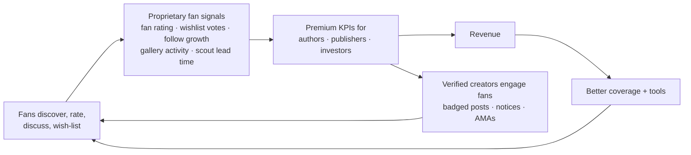

# Product spec: Plotline as IMDb + DCInside for story IP

Status: **draft for review** (Phase 1: product definition). Scope: web novels and web comics.
Companion docs: [architecture.md](architecture.md) · [wireframes.html](wireframes.html).

Claims in this document are tagged:

| Tag | Meaning |
|---|---|
| **[code]** | Verified in this repository, with a path and line number. |
| **[ext]** | Backed by an external source listed at the end. |
| **[hyp]** | A design hypothesis. It is not proven and needs validation through the metrics in §8. |

## 1. Why the revamp

Today Plotline serves one audience, analysts, through a password-gated explorer (`web/_worker.js`) and a read-only API (`src/api/main.py`). **[code]**
- **Premium today:** the only premium surface is `/feed/titles`, behind an API key (`src/api/main.py:145`). **[code]**
- **Tiers today:** Free / Pro $49 / Enterprise (`src/api/billing.py:27-34`). **[code]**
- **Missing:** user accounts, community, ownership verification and valuation. A code search for these found nothing. **[code]**

The revamp turns the product into a two-sided platform:
- **Fans** get a free, IMDb-style database of titles, and DCInside-style galleries for discussing them.
- **Authors, publishers and IP investors** pay for deeper analytics after their ownership or authority is verified by manual document review.

## 2. Personas and jobs-to-be-done

| Persona | Access | Qualification | Primary job | Key question |
|---|---|---|---|---|
| Fan | Free | None to read. Anonymous (DC-style guest) or account to post | Find the next thing to read and talk about it with people who care | "What's good, what's rising, what do other fans think?" |
| Author | Paid | Approved claim on a listed author or title (document review) | Grow their own titles and decide what to write next | "How am I doing against comparable titles, and why?" |
| Publisher | Paid | Approved claim on a listed publisher or title (document review) | Acquire, manage and benchmark a portfolio | "Which IP should I sign, and how does my slate compare?" |
| IP investor | Paid | Approved claim on an **authorized entity** such as a PE/VC fund, studio or registered company (document review) | Price and time IP deals | "What is this IP worth, and is its demand real and durable?" |

## 3. Product thesis: the fan-data flywheel **[hyp]**



- **The moat is fan signals, not scraped metrics.** Scraped metrics come from public pages and anyone can reproduce them. Fan ratings, adaptation-wish votes and early-discovery timing exist only on Plotline.
- **Selection rule.** A fan feature ships only if it (a) is rewarding for fans on its own and (b) produces a signal a paid persona would use.
- **Paywall as acquisition.** Fan-facing title pages show locked premium panels, which turns fan traffic into a funnel for paid personas.

## 4. Feature set

### 4.0 Market overview: the story-IP market (all personas; fan-facing home)

The home screen treats story IP as a market. Its layout follows patterns from Finviz (index mini-charts, advancing/declining breadth, gainer and loser tables, sector heat-map treemap) and Naver Stock (index strip, rolling tickers, rising/falling and volume rankings, theme boards, IPO calendar).

> **Source caveat.** Both reference sites were blocked from this build environment (finviz.com by the egress proxy; stock.naver.com refused the fetch). The patterns above come from general knowledge of those sites and were not checked against their live pages.

| Market element | Plotline equivalent | Source | Status |
|---|---|---|---|
| Index | Genre index: chain-linked **reach** index (total views of titles observed on consecutive days), rebased to 1,000. The data has no per-day PlotScore, so the prototype's PlotScore-weighted index was replaced by this one (`src/app/market/indices.py`) | `agg_genre_daily` (`genre_parent`, `date`, `total_views`, `avg_plotscore`) in `src/db/star_schema.py` | **new** |
| Composite index | PLT-ALL, PLT-CMX (comics), PLT-NOV (novels) | same | **new** |
| Price / % change | PlotScore and its 1D / 1W / 1M change; rank Δ 7D | `fact_score`, `fact_title_daily.rank` | existing |
| Volume | Fan activity per day (posts + comments + ratings) | community, fan | **new** |
| Breadth | Advancing vs declining titles; count at a 120-day high | `fact_title_daily` | **new** |
| Heat map | Treemap: genre (or publisher) → title, sized by reach, colored by Δ | explorer market map (`docs/user-guide/tabs.md`) | existing, restyled |
| IPO / new listings | Titles first seen in the last 30 days, shown in a moving banner and a calendar | `dim_title.first_seen` | existing field, **new** view |
| Upcoming IPOs | Announced titles from platform "coming soon" pages | not scraped today | **new data source** |
| Market cap | Valuation band (premium, model) | valuation (§5) | **new** |

Up/down colors follow a user-selectable convention: KR (red up, blue down, the default) or US (green up, red down). The US green/red pair fails the colorblind separation check (validator ΔE 5.5 under deuteranopia), so every change also carries a ▲/▼ glyph and a sign.

### 4.1 Fans (free)

| Feature | Fan value | Signal it produces (paid value) | Wireframe |
|---|---|---|---|
| Title page with PlotScore and fan rating (1–10) | One trusted page per IP | Fan rating distribution per title | S3 |
| Galleries per title, per genre and free boards: DC-style list, concept tab, anonymous posting | A place to talk without the friction of signing up | Gallery activity and discussion volume | S4–S6 |
| Episode threads, auto-created when the scraper sees a new episode | A daily reason to return | Episode-level reaction volume | S7 |
| Adaptation wishlist (anime / drama / film votes) | Fans feel heard | Adaptation demand signal | S8 |
| Scout reputation: points for following or rating a title before it enters Rising | Status for good taste | Leading indicator (scout lead time) | S10 |
| Charts: Trending, Rising, top fan-rated, concept feed | Discovery | None (surface only) | S1, S2 |
| Credits pages for authors and publishers | Follow creators across platforms | Follow growth per creator | S9 |
| Lists and watchlist | Curation and identity | Co-occurrence of titles in lists | S10 |

Fan-rating integrity **[ext]**:
- IMDb displays a *weighted* average rather than a plain mean, specifically to resist vote manipulation, and does not disclose its formula. Plotline should do the same.
- The raw mean, the vote count and the distribution are shown next to the weighted value.
- Verified owners' votes on their own titles are excluded from the weighted value.

Anonymous posting, modeled on DCInside guest posting:
- A guest supplies a nickname and a password; the password is needed to edit or delete.
- The first two IP octets are shown next to the nickname.
- The full IP is stored only as a salted hash for rate limits and bans.

Concept promotion **[ext] [hyp]**:
- DCInside raises upvoted ("recommended") posts into a concept list. Its exact criteria are not public.
- Plotline makes the rule an explicit, configurable policy: `up ≥ N` and `up/(up+down) ≥ r`.

### 4.2 Author (paid)
- **Creator dashboard**:
  - exact metric time series for claimed titles
  - engagement decay across episodes (`src/models/unit_stats.py:52-60`) **[code]**
  - release cadence compared with genre peers (`src/models/episode_analytics.py:57`) **[code]**
  - fan rating distribution, gallery activity and wishlist votes
- **Competitor compare**: side by side with any other title, per your answer on competitor scope. Shows PlotScore components (`src/models/plotscore.py:36`) **[code]**, like-through and the revenue band.
- **What to make next**: genre whitespace and HHI (`src/models/kpi_layers.py`, `_genre`) **[code]**, the Blue Ocean gap (`src/models/gap_analysis.py`) **[code]** and art-style correlation (`src/models/art_style.py`) **[code]**.
- **Fan tools**: a verified badge in their galleries, pinned notices and AMA threads.

### 4.3 Publisher (paid)
- **Scouting board** ranked by:
  - adaptation readiness (`src/reports/explorer_assets/template.html:614-625`) **[code]**
  - wishlist votes
  - momentum
  - completion status
- **Portfolio**: claimed titles and authors rolled up and benchmarked against other publishers. The publisher dimension is empty today (the note on commit `9a08bd4` says `dim_publisher` stays empty until adapters extract studios) **[code]**, so this needs Phase 2 adapter work.
- **Market structure**: genre HHI, whitespace and platform mix (`src/models/kpi_layers.py`, `_genre` and `_platform`) **[code]**.

### 4.4 IP investor (paid)
- **IP dossier**:
  - valuation band with its drivers and assumptions
  - modeled revenue band
  - cross-platform reach (`src/models/entity_resolution.py`) **[code]**
  - fan demand signals
  - author track record (`src/models/kpi_layers.py`, `_author`) **[code]**
  - comparable titles
- **Comparable deals panel**: stays empty until deal data exists. `rel_contract` is schema-only (`src/db/star_schema.py:206`) and loads `data/manual/contracts.csv` only if that file exists **[code]**.
- **Watch alerts** on momentum changes.

### 4.5 Admin
- **Claim review queue**: view the documents, approve, or reject with a note.
- **Moderation queue**: reports, soft delete, bans by IP hash, gallery moderator assignment.

## 5. Valuation model (new; design only)

A revenue-multiple band, as you chose:

```text
annual_{low,mid,high} = est_monthly_usd × 12 × {LOW_MULT, 1, HIGH_MULT}
valuation_{low,mid,high} = annual_{low,mid,high} × base_multiple_{low,mid,high} × adj
adj = clamp(1 + w_m·(momentum_pct−0.5) + w_c·completed + w_x·log(1+platform_count−1)·…, 0.5, 2.0)
```

- **Inputs:** `est_monthly_usd` is an existing model output (`src/models/earnings.py`), and `LOW_MULT, HIGH_MULT = 0.4, 2.5` (`src/models/earnings.py:54`) **[code]**.
- **The multiples and weights are placeholders for you to set.** No public dataset of story-IP deal multiples was found for this spec, so none are asserted here. They live in config, not in code.
- **Response contract:** every valuation and revenue response carries `is_model: true`, the band, the list of drivers and the assumptions used. `earnings.py:3-6` already states that no platform publishes creator earnings **[code]**.

## 6. KPI assessment: keep, drop or gate per persona

Legend: ✔ shown · 🔒 premium only · ✘ hidden · *admin* means internal only.

| KPI | Source | Fan | Author | Publisher | Investor | Rationale |
|---|---|---|---|---|---|---|
| PlotScore | `plotscore.py` | ✔ | ✔ | ✔ | ✔ | Headline rank, the analogue of IMDb's rating |
| PlotScore components (5 percentiles) | `plotscore.py:36` | ✘ | 🔒 | 🔒 | 🔒 | Diagnostic ("why"); noise for fans |
| Views / subscribers / likes / comments | `fact_title_daily` | ✔ rounded | 🔒 exact + series | 🔒 | 🔒 | Fans need scale, not precision |
| Platform rating | `fact_title_daily.rating` | ✔ | ✔ | ✔ | ✔ | Discovery |
| Rank, best rank, movement, Rising badge | `fact_score`, trends | ✔ | ✔ | ✔ | ✔ | Discovery |
| Status, tags, genre, synopsis, cover | `dim_title` | ✔ | ✔ | ✔ | ✔ | Discovery |
| Release cadence (episodes/week) | `episode_analytics.py:57` | ✔ | ✔ | ✔ | ✔ | Fans plan their reading; B2B sees productivity |
| Engagement decay across episodes | `unit_stats.py:52-60` | ✘ | 🔒 | 🔒 | 🔒 | Retention diagnostic |
| Like-through, subs-per-view | `kpi_layers.py` (`_base`) | ✘ | 🔒 | 🔒 | 🔒 | Engagement quality |
| Momentum (raw) / Mann-Kendall | `advanced_metrics.py`, `trends_engine.py` | ✔ badge only | 🔒 | 🔒 | 🔒 | Statistics are premium |
| Modeled revenue band | `earnings.py` | ✘ | 🔒 | 🔒 | 🔒 | Commercially sensitive, and a model |
| Valuation band | new (§5) | ✘ | 🔒 | 🔒 | 🔒 | Core investor question |
| Adaptation readiness | `template.html:614-625` | ✘ | 🔒 | 🔒 | 🔒 | Scouting signal; move to Python in Phase 2 |
| Genre HHI / market type / whitespace | `kpi_layers.py` (`_genre`) | ✘ | 🔒 | 🔒 | 🔒 | Market structure is a B2B question |
| Blue Ocean gaps | `gap_analysis.py` | ✘ | 🔒 | 🔒 | 🔒 | What to make or acquire next |
| Art-style group | `art_style.py` | ✔ facet | 🔒 correlation | 🔒 | ✘ | Fans browse by style; investors do not need it |
| Cross-platform reach | `entity_resolution.py` | ✔ count | 🔒 | 🔒 | 🔒 | "Where to read" for fans |
| Author track record | `kpi_layers.py` (`_author`) | ✔ credits | 🔒 metrics | 🔒 | 🔒 | IMDb-style credits page vs analytics |
| Publisher portfolio | `kpi_layers.py` (`_publisher`) | ✔ credits | ✘ | 🔒 | 🔒 | Blocked on publisher data (§4.3) |
| Platform aggregates | `kpi_layers.py` (`_platform`) | ✔ titles, reach | 🔒 | 🔒 | 🔒 | |
| **Fan rating (weighted), distribution** | new | ✔ | ✔ | ✔ | ✔ | Core IMDb value |
| **Wishlist votes, gallery activity, follow growth, scout lead time** | new | ✔ totals | 🔒 trends | 🔒 | 🔒 | The flywheel signals (§3) |
| **Genre / composite index, breadth, 120-day highs** | new, derived from `agg_genre_daily`, `fact_title_daily` | ✔ | ✔ | ✔ | ✔ | Market pulse for everyone; the home screen (§4.0) |
| **New listings (IPO)** | `dim_title.first_seen` | ✔ | ✔ | ✔ | ✔ | Discovery; feeds scout points |
| **Fan activity "volume"** | new (community + fan) | ✔ totals | 🔒 trend | 🔒 | 🔒 | Makes fan activity visible, which encourages more of it |
| `novel_share`, `cover_coverage_pct`, `coverage_pct`, `with_cover` | `kpi_layers.py` | ✘ | ✘ | ✘ | ✘ | **Drop from the product.** Data-quality metrics with no user value; admin only |

This table is the seed for `kpi_registry` (see [architecture.md](architecture.md) §4). In Phase 2, code enforces it from a single declaration, and this table is generated from that declaration.

## 7. Plans and entitlements

| Plan | Price | Requires | Unlocks |
|---|---|---|---|
| Fan | Free | Nothing (an account for ratings, lists and follows; guests can post) | All ✔ rows in §6 |
| Author | TBD | Approved author or title claim | 🔒 rows, all titles at full depth, creator dashboard, fan tools |
| Publisher | TBD | Approved publisher or title claim | 🔒 rows, scouting, portfolio, market structure |
| Investor | TBD | Approved authorized-entity claim | 🔒 rows, IP dossier, valuation, alerts |

Prices are left as config placeholders, per your answer. While `PLOTLINE_BILLING_ENABLED` is false, checkout records a waitlist entry instead of charging (`src/api/billing.py:3-8`) **[code]**. That gate is kept.

## 8. Validation metrics for the flywheel **[hyp]**

| Loop step | Metric | Why |
|---|---|---|
| Fans show up | Weekly active fans; D7 return of gallery posters | Community health |
| Fans create signal | Share of titles with ≥ 20 fan ratings; wishlist votes per week | Signal density that paid KPIs depend on |
| Signal has value | Premium dashboard views of fan-signal panels; scout lead time against later rank gain | Whether fan signals predict or matter |
| Paid conversion | Claim submissions → approvals → paid, by persona | Funnel |
| Creators feed fans | Verified posts per week; fan activity in galleries with a verified author vs without | Supply side of the loop |

Thresholds (such as the 20 ratings) are starting points to tune, not benchmarks.

## 9. Phase 2 build order (proposed)
1. `core` + `identity` + `entitlement` + `kpi` registry. Existing public endpoints start projecting through the registry.
2. `community`: galleries, posts, comments, votes, reports, anonymous identity.
3. `fan`: ratings, follows, lists, wishlist, credits.
4. `verification`: claims, document storage, admin queue.
5. `valuation` + `premium` endpoints; port adaptation readiness to Python.
6. Scout reputation and episode threads, which need events from the scrape pipeline.
7. Frontend built from the approved wireframes.

## Sources
- IMDb weighted rating and its anti-manipulation purpose: [IMDb Help: "The vote average for film X should be Y"](https://help.imdb.com/article/imdb/track-movies-tv/the-vote-average-for-film-x-should-be-y-why-are-you-displaying-another-rating/G3RC8ZNFAGWNTX4L)
- DCInside galleries, recommendation and concept posts: [DCinside, Wikipedia](https://en.wikipedia.org/wiki/DCinside) · [DC Inside, NamuWiki](https://en.namu.wiki/w/%EB%94%94%EC%8B%9C%EC%9D%B8%EC%82%AC%EC%9D%B4%EB%93%9C) · [DCInside Best Posts board](https://en.dcinside.com/board/best)
- Everything tagged **[code]**: this repository at commit `9a08bd4`.
